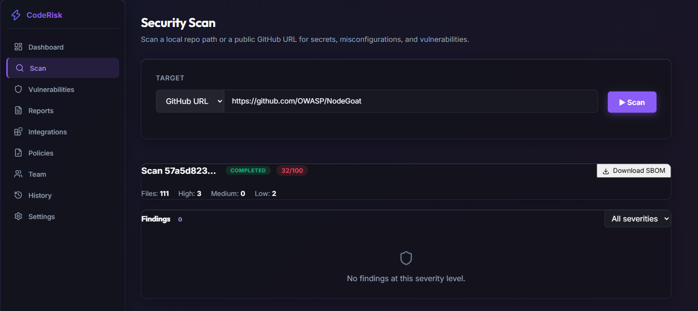
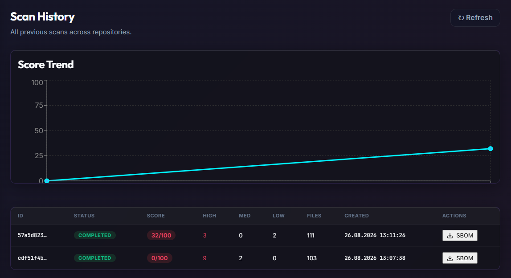

# CodeRisk Dashboard
Developed by Bor-Code

CodeRisk Dashboard is a comprehensive, automated static application security testing (SAST) and software composition analysis (SCA) platform. It allows engineering and security teams to scan local repositories or public GitHub URLs to detect vulnerabilities, secret leaks, and misconfigurations.

## Key Features

* Automated Security Scanning: Seamlessly scans codebases using multiple integrated security engines.
* Secret Detection: Utilizes Gitleaks to identify hardcoded passwords, API keys, and tokens.
* Vulnerability Analysis: Integrates Semgrep to detect insecure coding patterns and vulnerabilities such as SQL Injection and XSS.
* Open Source Security: Uses OSV-Scanner to find known vulnerabilities in third-party dependencies.
* Interactive Dashboard: Provides a modern, dark-themed glassmorphism UI to view scan results, severity metrics, and historical score trends.
* Cloud-Native Architecture: Built to be deployed effortlessly on modern cloud infrastructure.

## Screenshots

### Security Scan Interface


### Scan History & Analytics


## Architecture

* Frontend: React 18, TypeScript, Vite, CSS (Glassmorphism UI)
* Backend: Python 3.11, FastAPI, SQLAlchemy, Alembic
* Database: PostgreSQL (Supabase)
* Deployment: Vercel (Frontend) and Render (Backend Docker Container)

## Local Development Setup

### Prerequisites
* Node.js (v18 or higher)
* Python (3.11 or higher)
* uv (Python package installer and resolver)

### 1. Clone the Repository
```bash
git clone https://github.com/Bor-Code-Code-Dashboard/CodeRisk-Dashboard.git
cd CodeRisk-Dashboard
```

### 2. Backend Setup
```bash
cd backend
# Install dependencies using uv
uv sync

# Run database migrations (SQLite is used by default for local development)
uv run alembic upgrade head

# Start the FastAPI server
uv run uvicorn app.main:app --reload
```
The backend will be available at `http://127.0.0.1:8000`.

### 3. Frontend Setup
Open a new terminal window:
```bash
cd frontend

# Create a local environment file
echo "VITE_API_BASE_URL=http://127.0.0.1:8000/api/v1" > .env.local

# Install dependencies and start the Vite dev server
npm install
npm run dev
```
The frontend will be available at `http://localhost:5173`.

## Environment Variables

For production deployments, the following environment variables are required:

### Backend (Render)
* `CODERISK_ENVIRONMENT`: Set to `production`
* `CODERISK_DATABASE_URL`: PostgreSQL connection string (e.g., Supabase IPv4 Pooler URL with psycopg driver)
* `CODERISK_JWT_SECRET_KEY`: A secure random string (minimum 32 characters)
* `CODERISK_CORS_ORIGINS`: JSON array of allowed origins (e.g., `["https://your-frontend.vercel.app"]`)

### Frontend (Vercel)
* `VITE_API_BASE_URL`: URL of the deployed backend API (e.g., `https://your-backend.onrender.com/api/v1`)

## License

This project is licensed under the MIT License.
